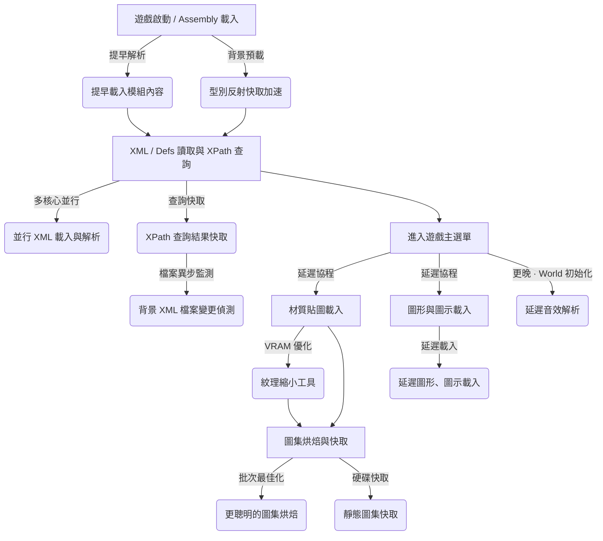

# Faster Game Loading - Continued

[](http://rimworldgame.com/)

這款模組專為解決 RimWorld 在加載海量 Mod 時啟動緩慢、磁碟 I/O 瓶頸、以及單核 CPU 卡頓而設計。它透過多個底層 Hook（Harmony Patches），在不改變任何遊戲機制與存檔安全的前提下，大幅提速遊戲啟動。

---

## 🎮 RimWorld 遊戲啟動流程與本模組優化切入點

RimWorld 的啟動是一個高度複雜的初始化過程，本模組在多個關鍵階段介入，將原生的單核、同步行為重構為多執行緒並行與智慧快取：



### 1. 初始化與 Assembly 載入階段

* **原生行為**：遊戲順序加載核心與所有第三方 Mod 的 `.dll` 動態連結庫，並進行反射掃描與準備。這會引發嚴重的單核 CPU 佔用。
* **本模組優化**：
  * **提早載入模組內容 (Early Mod Content Loading)**：在主執行緒空閒或等待的間隙，提前觸發 Assemblies 的反射解析。
  * **型別反射快取加速**：背景預載入並快取 `AccessTools.AllTypes`、`TypeByName`、`GenTypes.GetTypeInAnyAssemblyInt`、`AllLeafSubclasses` 等反射查詢結果，部分快取可跨 session 持久化，大幅減少重複反射掃描開銷。

### 2. XML/Defs 讀取與 XPath 查詢階段

* **原生行為**：讀取所有 Mod 底下的 Def XML 檔案，並利用 `XmlNode.SelectSingleNode` 進行上百萬次的 XPath 節點查詢。此階段為嚴重的 I/O 與 CPU 瓶頸。
* **本模組優化**：
  * **多執行緒並行 XML 載入與解析**：使用 `Parallel.For` 多核心並行讀取 XML 並解析為 DOM 樹，大幅降低磁碟 I/O 阻塞。
  * **XPath 查詢結果快取**：快取所有節點查詢結果（特別是確認不存在的缺失屬性），下次啟動遇到相同查詢直接返回 `null`，避免了昂貴的 XML DOM 遍歷。
  * **背景雜湊檢測**：背景異步計算所有 XML 檔案的雙層雜湊。首先比對每個模組的 XML 檔案 metadata 雜湊，若有變更則進一步計算實質 MD5 內容雜湊。只有在 XML 實質內容變更時才重置快取，避免因 Steam 同步更新檔案修改時間但內容未變時錯誤清除快取，保證資料安全且不失快取優勢。

### 3. 材質貼圖載入階段

* **原生行為**：讀取所有 Mod 下的圖像檔案（如 PNG），將其加載為 Unity 的 `Texture2D`。大量高解析度材質會耗費數十秒甚至數分鐘，並耗盡顯示記憶體（VRAM）。
* **本模組優化**：
  * **紋理縮小工具 (Texture Downscaler)**：將超高解析度材質安全地縮小至目標大小並快取，在不改變原 Mod 檔案的情況下減少載入負荷。

### 4. 圖集烘焙與快取階段

* **原生行為**：遊戲開始拼合靜態圖集（Static Atlases）。
* **本模組優化**：
  * **更聰明的圖集烘焙 (Smarter Atlas Baking)**：動態感應 GPU 效能，調整單次烘焙批次大小，減少啟動過程中的微卡頓；若遇到 HAR、Ancot 等多遮罩或自訂渲染框架，會將相關貼圖排除在靜態圖集之外。
  * **靜態圖集快取 (Static Atlases Caching)**：將烘焙好的圖集數據快取至磁碟，下次啟動直接載入，並以來源路徑為貼圖識別鍵，避免不同 Mod 的同名貼圖錯誤復用。

### 5. 圖形與音效解析階段

* **原生行為**：遊戲在啟動期間同步解析所有 ThingDef 的圖形（`GraphicData.Init`）與所有 SubSoundDef 的音效（`SubSoundDef.ResolveReferences`），即使這些資源在進入遊戲前並不需要立即顯示或播放。
* **本模組優化**：
  * **延遲圖形、圖示與音效載入 (Delay Graphic, Icon & Sound Loading)**：將非必要的圖形載入延遲到遊戲進入後，在每幀時間預算內批次處理；同時將音效解析延遲到世界初始化完成後執行，啟動期間攔截所有聲音播放請求以避免錯誤。

---

## 🛠️ 各優化功能技術細節與概念

本模組的所有優化可歸納為三大核心類別：

### 📁 類別 A：XML 與資料載入優化

#### 1. 提早載入模組內容 (Early Mod Content Loading) `預設開啟`

* **概念**：原生 RimWorld 依序同步加載每個 Mod。但在加載的某些時間點（如等待磁碟 I/O 或等待特定靜態解析時），主執行緒會處於閒置等待狀態。
* **技術細節**：
  * 攔截 `ModContentPack.ReloadContentInt`（以及相關的資源初審加載點）。
  * 將 Mod 內容（包括 DLL 和 XML 虛擬檔案目錄）的預解析放到更早的初始化時間段中，利用主執行緒原本會被阻塞的等待空檔提前處理。
  * 使得原生遊戲在執行後續載入步驟時，能直接使用已經提前解析好的記憶體目錄，從而消除等待空檔。
  * **型別反射快取加速**：背景預載入所有型別，並快取 `AccessTools.AllTypes()`、`AccessTools.TypeByName()`、`GenTypes.GetTypeInAnyAssemblyInt()`、`GenTypes.AllLeafSubclasses()` 等高頻反射查詢結果。型別名稱映射可跨 session 持久化，避免每次啟動都重新掃描所有 Assembly。

#### 2. 多執行緒預載入 / 多執行緒並行 XML 載入與解析 (Enable multi-threaded preloading) `預設開啟`

* **概念**：原生 RimWorld 採用單核、單執行緒依次讀取與解析每個 Mod 下的 XML 檔案，無法發揮現代多核心 CPU 的效能。
* **技術細節**：
  * 攔截 `DirectXmlLoader.XmlAssetsInModFolder`。
  * 使用 `Parallel.For` 多核心並行讀取 XML 實體檔案並實例化 `LoadableXmlAsset`。由於每個 XML 實例的載入與 DOM 解析在記憶體中是執行緒安全的，因此能大幅度降低磁碟 I/O 阻塞。
  * **安全回退 (Fallback)**：若並行解析過程中發生任何例外（例如髒資料或例外空值），會自動啟動 Fallback 安全閥，放行回原生的單執行緒加載，確保 100% 的相容性與遊戲可啟動性。

#### 3. XPath 快取與背景變更偵測 (XPath Caching) `預設開啟`

* **概念**：遊戲在啟動時會執行上百萬次 `XmlNode.SelectSingleNode` (XPath 查詢)，其中絕大部分是 Mod 在尋找不一定存在的 Def 擴展欄位，造成嚴重的 CPU 運算浪費。
* **技術細節**：
  * **缺失快取機制**：攔截 `XmlNode.SelectSingleNode`。將查詢結果（成功/失敗）記錄於記憶體中。在順利進入主選單後，將「不存在的查詢路徑」寫入設定檔（`xmlPathsSinceLastSession`）。下一次啟動時，若遇到相同路徑直接返回 `null`。
  * **背景雙層雜湊檢測**：在啟動建構子中利用 `Task.Run` 開啟背景執行緒，透過雙層雜湊（metadata 雜湊 + 實質內容 MD5 雜湊）監測第三方模組與 Config 中的 XML。若僅為 Steam 同步導致的修改時間變更，則保留 XPath 快取；只有在 XML 內容實質變更時才清空快取，大幅提升快取命中率與啟動效能。

---

### 🎨 類別 B：材質貼圖與圖集優化

#### 4. 縮小紋理工具 (Downscale textures) `手動觸發`

* **概念**：超高解析度（HD）的貼圖在載入時非常消耗 VRAM 顯存與硬碟讀取時間，但實際遊戲中許多小物件並不需要如此高解析度的貼圖。
* **技術細節**：
  * 提供了一套預設的類別大小限制（如建築 256px、人物 256px、地形 1024px）。
  * **離線快取設計**：啟用後，模組在背景對所有符合的 Mod 紋理進行雙線性（Bilinear）降採樣縮小，並將縮小後的圖片快取在獨立目錄中，完全不破壞原 Mod 檔案。快取判定已進行優化，若原始檔案修改時間變更但長度不變，會自動 Touch 快取檔案時間，避免不必要的重新降階。
  * **執行期載入替換**：在啟動時，若檢測到該紋理存在縮小快取，直接載入快取版本，大幅縮短 I/O 與降低顯存佔用。
  * **Image Opt 相容性安全閥**：本功能會自動檢測 [Image Opt](https://steamcommunity.com/sharedfiles/filedetails/?id=3543873568) (`dev.soeur.imageopt`) 模組。若檢測到其啟用，紋理縮小工具將自動跳過（立即放行回原始載入流程），確保其 DDS 壓縮與多核心載入邏輯不受干擾，防範重複覆寫貼圖資料產生的圖像衝突或崩潰。

#### 5. 更聰明的圖集烘焙 (Smarter Atlas Baking) `預設關閉`

* **概念**：RimWorld 啟動時會把碎圖拼合成靜態圖集（Static Atlases）。原生拼合是一次性、寫死大小的同步處理，會造成畫面微凍結甚至顯示驅動重設（TDR 逾時）。
* **技術細節**：
  * 攔截 `GlobalTextureAtlasManager.BakeStaticAtlases` 或圖集烘焙迴圈。
  * **動態批次最佳化**：根據玩家當前顯示卡（GPU）的烘焙效能與硬體規格，自適應地調整單次烘焙的紋理批次大小（Batch Size），減緩主執行緒被大量 I/O 與紋理上傳操作（TexImage2D）卡死的現象，顯著減少加載過程中的微卡頓。時間切片下限與圖集尺寸分離，避免慢速 GPU 被過大的最小批次拖出長幀。
  * **圖集烘焙排除名單**：自動偵測特定 Mod（如 Bionic Icons、Ancot Library 框架及其種族如 Kiiro Race、Ayameduki 等外星人種族）的紋理，將其排除在靜態圖集拼合之外，避免多遮罩（multi-mask）造成的圖案衝突與載入不全。本模組會動態檢測所有依賴 Humanoid Alien Races (HAR) 或 `Ancot.AncotLibrary` 的種族 Mod 並將其自動加入排除名單。
  * **載入時機安全性**：排除名單除了使用 `ModsConfig.IsActive`，也會掃描 `LoadedModManager.RunningMods` 作為備援，避免在啟動早期因 Mod 啟用狀態尚未完全穩定而錯過 Ancot/HAR 相關 Mod。

#### 6. 靜態圖集快取 (Static Atlases Caching) `預設關閉`

* **概念**：每次啟動 RimWorld 都需要重新計算並烘焙一遍相同的靜態圖集，耗費重複的 CPU 計算資源。
* **技術細節**：
  * 攔截圖集烘焙結果，將烘焙好的圖集貼圖與座標映射數據直接以二進位快取（Binary Cache）形式持久化存檔。
  * 下次啟動遊戲時，如果檢測到 Mod 列表與順序沒有變更，直接讀取快取中的圖集，跳過整個複雜的靜態圖集重新拼合與計算過程。
  * **快取版本 v4**：快取 manifest 會記錄每張貼圖的來源路徑 key，並將 mask 貼圖納入佇列雜湊，避免不同 Mod 的同名貼圖、同尺寸貼圖或遮罩變更造成錯誤快取命中。模組組合雜湊額外折入圖集排除名單（BakingSkipList）解析結果、Unity 與遊戲版本字串、以及貼圖壓縮設定，確保任何影響烘焙輸出的因子變更時舊快取都能正確失效。manifest 同時記錄彩色貼圖的 mip 層數與遮罩貼圖的實際尺寸，快取還原時可完整重現原版烘焙的遠距離渲染品質。舊版圖集快取會自動失效並重建。
  * **載入前完整性驗證**：讀取快取時會依貼圖格式（RGBA32、DXT1/DXT5 等）預先計算期望位元組數，若快取檔案遭截斷或損毀則跳過該快取項目並回退至正常烘焙，防止 `LoadRawTextureData` 崩潰。

---

### 🖼️ 類別 C：延遲載入優化

#### 7. 延遲圖形、圖示與音效載入 (Delay Graphic, Icon & Sound Loading) `預設關閉`

* **概念**：原生 RimWorld 在啟動期間同步解析所有 ThingDef 的圖形（`GraphicData.Init`）與所有 SubSoundDef 的音效資源（AudioGrain 載入等），即使許多物件的圖形在進入遊戲前並不需要立即顯示，啟動期間也不需要播放任何音效。這會造成大量不必要的 I/O 與紋理上傳。
* **技術細節**：
  * **Transpiler 攔截 `ThingDef.PostLoad`**：將 `LongEventHandler.ExecuteWhenFinished` 中的非必要圖形載入動作重新導向到延遲佇列。透過 `ShouldBeLoadedImmediately()` 判斷是否為武器、裝備、食物、建築等常用類型（立即載入），其餘延遲處理。
  * **GraphicData 快取複用**：攔截 `GraphicData.Init`，以 `texPath` 為鍵快取已初始化的 `GraphicData` 實例。相同 texPath 且參數完全相同的 GraphicData 直接複用 `cachedGraphic`，跳過重複的初始化。
  * **時間預算排程**：使用 `DelayedActions` MonoBehaviour，在遊戲中每幀最多佔用 8ms（主選單中 50ms），批次處理延遲的圖形載入、圖示解析與地圖網格更新。
  * **Transpiler 攔截 `SubSoundDef.ResolveReferences`**：將音效解析動作排入延遲佇列，之後由 `DelayedActions` 的協程批次處理。
  * **啟動期間靜音保護**：在音效尚未解析完畢前，攔截 `SoundStarter.PlayOneShotOnCamera`、`PlayOneShot`、`TrySpawnSustainer` 以及 `SubSoundDef.TryPlay`，避免提早播放導致 `NullReferenceException`。
  * **世界初始化後恢復**：`World.FinalizeInit` Postfix 觸發所有累積的音效解析，完成後自動 Unpatch 恢復正常聲音播放。

---

## ⚙️ 相容性

* **[Loading Progress](https://github.com/ilyvion/loading-progress/)**：完美相容。本模組會將載入進度精準輸出給 Loading Progress 顯示，並主動修復了 FGL 進度條在 Loading Progress 接手 Mod 載入期間不更新的問題。
* **[Missile Girl](https://github.com/ViralReaction/MissileGirl)**：完美相容。作為 RocketMan 針對 RimWorld 1.6 版本的現代更新分支，除了優化遊戲內的運行 Tick 外，還提供加載速度提升、警報節流以及大規模數據與屬性快取，與本模組對「啟動階段」的優化相輔相成，是極力推薦的全方位性能組合。
* **[DefLoadCache](https://github.com/FluxxField/rimworld-defload-cache)**：完美相容。當其快取失效重新建置時，本模組會大幅加速其 XML 載入過程。
* **[Image Opt](https://steamcommunity.com/sharedfiles/filedetails/?id=3543873568)**：完美相容。當檢測到其啟用時，本模組會自動停用紋理縮小工具（Texture Downscaler），以防止兩者衝突，將貼圖處理安全地交由 Image Opt 處理。
* **[HugsLib](https://github.com/UnlimitedHugs/RimworldHugsLib)**：完美相容。當延遲圖形載入啟用時，本模組會自動將 `HugsLibController.OnDefsLoaded` 重新導向到主執行緒執行，避免初始化時序衝突。
* **[XmlExtensions](https://github.com/15adhami/XmlExtensions)**：完美相容。當檢測到其啟用時，XPath 快取功能會自動停用，避免與 XmlExtensions 的自訂 XML 處理邏輯衝突。
* **[AyaTweaks 2.0 (Ayameduki Tweaks)](https://gitlab.com/wrelick-rimworld/ayatweaks2.0)**：完美相容。本模組會自動偵測並將所有 Ayameduki 相關 Mod (`Ayameduki.*`) 以及 WRelicK 的翻譯與補丁 (`WRK.*`) 排除在「提早載入」與「多執行緒 XML 載入」之外，以確保其複雜的 Patch 載入順序與執行緒安全完全正常，防止爆紅。
* **[Alien Races (Humanoid Alien Races)](https://github.com/erdelf/AlienRaces)**：嘗試相容。在所有 Mod 完成載入後，本模組會自動重新觸發 Alien Races 的 extended graphics variant 掃描，確保外星種族的圖形正確載入。**同時，本模組會自動偵測並動態排除所有依賴 Humanoid Alien Races 的種族模組貼圖進入靜態圖集，從而徹底解決外星人種族的頭髮、耳朵等 bodyAddon 消失問題。**
* **[Ancot Library（Ancot's Races Framework）](https://steamcommunity.com/sharedfiles/filedetails/?id=2988801276)**：嘗試相容。本模組會偵測 `Ancot.AncotLibrary` 本體與所有在 `About.xml` 中聲明依賴它的種族模組（如 Kiiro Race、Tsukin Race 等），並**動態**將其根目錄下的外觀貼圖排除在靜態圖集烘焙之外。偵測流程同時使用 `ModsConfig.IsActive` 與 `LoadedModManager.RunningMods`，避免載入早期狀態尚未穩定時漏判，徹底避免 Ancot 旗下種族因自訂多重遮罩（Multi-mask）渲染節點造成的貼圖黑化或 bodyAddon 消失問題。

---

## 📁 Structure / 專案結構

此模組的源碼與目錄結構如下：

```text
FasterGameLoading/ (專案根目錄)
├── About/                # 模組基本資訊與 Steam 工作坊說明頁配置
├── Assemblies/           # 編譯後的 DLL 輸出目錄
├── LanguageData/         # 模組本機化翻譯資料 (XML)
├── SteamDescriptions/    # Steam 商店頁面說明配置
└── Source/               # 模組 C# 源碼目錄
    ├── Core/             # 模組入口點與初始化 (Mod 進入點、Startup 收尾、翻譯注入註冊)
    ├── Language/         # 翻譯注入器 (TranslationInjector、執行期注入模組翻譯鍵值)
    ├── Settings/         # 模組設定與跨會話 (Session) 載入歷史快取管理
    ├── XMLLoadingCache/  # XML 與資料載入優化 (多執行緒並行 XML 載入與 XPath 缺失快取)
    ├── EarlyModContentLoading/ # 提早載入與型別反射快取 (AccessTools、GenTypes 反射查詢快取)
    ├── TextureDownscaler/# 貼圖降質工具 (自動掃描、GPU 雙線性降採樣、WeakReference 快取、相容 Image Opt)
    ├── SmarterAtlasBaking/ # 自適應圖集烘焙 (協程分幀拼合、基於 GPU 效能的自適應批次調整演算法)
    ├── StaticAtlasesCache/ # 靜態圖集硬碟快取 (Raw DXT 載入與寫入、雙重雜湊校驗)
    ├── DelayGraphicAndIconLoading/ # 延遲圖形與圖示載入 (ThingDef.PostLoad 攔截、時間預算協程、BadTex 圖示修正)
    ├── DelaySoundLoading/  # 延遲音效載入 (SubSoundDef 解析延遲、啟動期靜音保護、世界初始化後 Unpatch)
    ├── Compatibility/    # 第三方模組相容性處理 (Image Opt、HugsLib、Humanoid Alien Races 等退避或延遲邏輯)
    ├── Utilities/        # 共用工具類別 (I/O 重試、全域常數、快取重置廣播器、日誌等)
    └── FasterGameLoading.Tests/ # 模組單元測試 (路徑雜湊失效、快取清理等 NUnit 測試)
```

---

## 📢 聲明與致謝

* 原作者為 **Taranchuk**。此版本為持續維護與修復錯誤的分支版本。
* 感謝遊戲社群的優化建議與貢獻！
* **🤖 Vibe Coding 聲明**：mushroomTW 相信未來的開發是屬於AI的。本模組的維護和重構由人類開發者與 AI 助理以 Vibe Coding 模式協同完成。開發者負責監督和測試，AI 負責撰寫程式和提供想法，使人類能專注於模組的性能優化本身。其合作成果就是：快，快，還要更快，就像這個模組的功能一樣。
