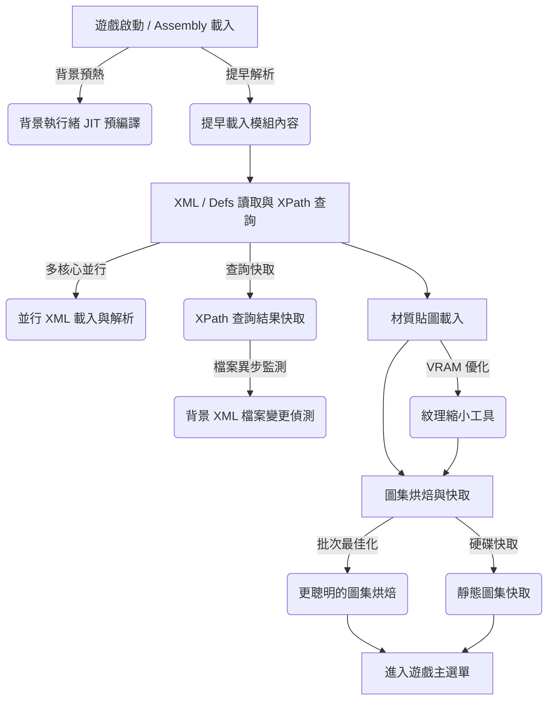

# Faster Game Loading - Continued

這款模組專為解決 RimWorld 在加載海量 Mod 時啟動緩慢、磁碟 I/O 瓶頸、以及單核 CPU 卡頓而設計。它透過多個底層 Hook（Harmony Patches），在不改變任何遊戲機制與存檔安全的前提下，大幅提速遊戲啟動。

---

## 🎮 RimWorld 遊戲啟動流程與本模組優化切入點

RimWorld 的啟動是一個高度複雜的初始化過程，本模組在多個關鍵階段介入，將原生的單核、同步行為重構為多執行緒並行與智慧快取：

### 1. 初始化與 Assembly 載入階段

* **原生行為**：遊戲順序加載核心與所有第三方 Mod 的 `.dll` 動態連結庫，並進行反射掃描與準備。這會引發嚴重的單核 CPU 佔用。
* **本模組優化**：
  * **提早載入模組內容 (Early Mod Content Loading)**：在主執行緒空閒或等待的間隙，提前觸發 Assemblies 的反射解析。
  * **背景執行緒 JIT 預編譯 (Background JIT Pre-compilation)**：利用背景執行緒對所有第三方 Mod 中的 C# 方法與建構子進行 `RuntimeHelpers.PrepareMethod` CLR 預編譯，將機器碼生成移出主執行緒，解決進入選單前的 Harmony Patch 與靜態構造卡頓。

### 2. XML/Defs 讀取與 XPath 查詢階段

* **原生行為**：讀取所有 Mod 底下的 Def XML 檔案，並利用 `XmlNode.SelectSingleNode` 進行上百萬次的 XPath 節點查詢。此階段為嚴重的 I/O 與 CPU 瓶頸。
* **本模組優化**：
  * **多執行緒並行 XML 載入與解析**：使用 `Parallel.For` 多核心並行讀取 XML 並解析為 DOM 樹，大幅降低磁碟 I/O 阻塞。
  * **XPath 查詢結果快取**：快取所有節點查詢結果（特別是確認不存在的缺失屬性），下次啟動遇到相同查詢直接返回 `null`，避免了昂貴認的 XML DOM 遍歷。
  * **背景 XML 檔案變更偵測**：背景異步計算所有 XML 檔案的結合雜湊（MD5/LastWriteTime），一旦檔案被玩家修改，自動在下次啟動清除快取，保證資料絕對同步與安全。

### 3. 材質貼圖載入階段

* **原生行為**：讀取所有 Mod 下的圖像檔案（如 PNG），將其加載為 Unity 的 `Texture2D`。大量高解析度材質會耗費數十秒甚至數分鐘，並耗盡顯示記憶體（VRAM）。
* **本模組優化**：
  * **紋理縮小工具 (Texture Downscaler)**：將超高解析度材質安全地縮小至目標大小並快取，在不改變原 Mod 檔案的情況下減少載入負荷。

### 4. 圖集烘焙與快取階段

* **原生行為**：遊戲開始拼合靜態圖集（Static Atlases）。
* **本模組優化**：
  * **更聰明的圖集烘焙 (Smarter Atlas Baking)**：動態感應 GPU 效能，調整單次烘焙批次大小，減少啟動過程中的微卡頓。
  * **靜態圖集快取 (Static Atlases Caching)**：將烘焙好的圖集數據快取至磁碟，下次啟動直接載入，縮減計算時間。

---

## 🛠️ 各優化功能技術細節與概念

本模組的所有優化可歸納為三大核心類別：

### 📁 類別 A：XML 與 資料載入優化

#### 1. 提早載入模組內容 (Early Mod Content Loading)

* **概念**：原生 RimWorld 依序同步加載每個 Mod。但在加載的某些時間點（如等待磁碟 I/O 或等待特定靜態解析時），主執行緒會處於閒置等待狀態。
* **技術細節**：
  * 攔截 `ModContentPack.ReloadContentInt`（以及相關的資源初審加載點）。
  * 將 Mod 內容（包括 DLL 和 XML 虛擬檔案目錄）的預解析放到更早的初始化時間段中，利用主執行緒原本會被阻塞的等待空檔提前處理。
  * 使得原生遊戲在執行後續載入步驟時，能直接使用已經提前解析好的記憶體目錄，從而消除等待空檔。

#### 2. 多執行緒預載入 / 多執行緒並行 XML 載入與解析 (Enable multi-threaded preloading)

* **概念**：原生 RimWorld 採用單核、單執行緒依次讀取與解析每個 Mod 下的 XML 檔案，無法發揮現代多核心 CPU 的效能。
* **技術細節**：
  * 攔截 `DirectXmlLoader.XmlAssetsInModFolder`。
  * 使用 `Parallel.For` 多核心並行讀取 XML 實體檔案並實例化 `LoadableXmlAsset`。由於每個 XML 實例的載入與 DOM 解析在記憶體中是執行緒安全的，因此能大幅度降低磁碟 I/O 阻塞。
  * **安全回退 (Fallback)**：若並行解析過程中發生任何例外（例如髒資料或例外空值），會自動啟動 Fallback 安全閥，放行回原生的單執行緒加載，確保 100% 的相容性與遊戲可啟動性。

#### 3. XPath 快取與背景變更偵測 (XPath Caching)

* **概念**：遊戲在啟動時會執行上百萬次 `XmlNode.SelectSingleNode` (XPath 查詢)，其中絕大部分是 Mod 在尋找不一定存在的 Def 擴展欄位，造成嚴重的 CPU 運算浪費。
* **技術細節**：
  * **缺失快取機制**：攔截 `XmlNode.SelectSingleNode`。將查詢結果（成功/失敗）記錄於記憶體中。在順利進入主選單後，將「不存在的查詢路徑」寫入設定檔（`xmlPathsSinceLastSession`）。下一次啟動時，若遇到相同路徑直接返回 `null`。
  * **背景雜湊檢測**：在啟動建構子中利用 `Task.Run` 開啟背景執行緒，計算所有第三方 Mod 下 `Defs/` 和 `Patches/` XML 的 LastWriteTime 和 Length 的 XOR 累積雜湊。一旦雜湊發生改變，主執行緒會在 `LateUpdate` 中執行執行緒安全的清空快取，確保資料 100% 正確。

---

### 🎨 類別 B：材質貼圖與圖集優化

#### 5. 縮小紋理工具 (Downscale textures)

* **概念**：超高解析度（HD）的貼圖在載入時非常消耗 VRAM 顯存與硬碟讀取時間，但實際遊戲中許多小物件並不需要如此高解析度的貼圖。
* **技術細節**：
  * 提供了一套預設的類別大小限制（如建築 256px、人物 256px、地形 1024px）。
  * **離線快取設計**：啟用後，模組在背景對所有符合的 Mod 紋理進行雙線性（Bilinear）降採樣縮小，並將縮小後的圖片快取在獨立目錄中，完全不破壞原 Mod 檔案。
  * **執行期載入替換**：在啟動時，若檢測到該紋理存在縮小快取，直接載入快取版本，大幅縮短 I/O 與降低顯存佔用。
  * **Image Opt 相容性安全閥**：本功能會自動檢測 [Image Opt](https://steamcommunity.com/sharedfiles/filedetails/?id=3543873568) (`dev.soeur.imageopt`) 模組。若檢測到其啟用，紋理縮小快取與延遲材質載入將自動跳過（立即放行回原始載入流程），確保其 DDS 壓縮與多核心載入邏輯不受干擾，防範重複覆寫貼圖資料產生的圖像衝突或崩潰。

#### 6. 更聰明的圖集烘焙 (Smarter Atlas Baking)

* **概念**：RimWorld 啟動時會把碎圖拼合成靜態圖集（Static Atlases）。原生拼合是一次性、寫死大小的同步處理，會造成畫面微凍結甚至顯示驅動重設（TDR 逾時）。
* **技術細節**：
  * 攔截 `GlobalTextureAtlasManager.BakeStaticAtlases` 或圖集烘焙迴圈。
  * **動態批次最佳化**：根據玩家當前顯示卡（GPU）的烘焙效能與硬體規格，自適應地調整單次烘焙的紋理批次大小（Batch Size），減緩主執行緒被大量 I/O 與紋理上傳操作（TexImage2D）卡死的現象，顯著減少加載過程中的微卡頓。

#### 7. 靜態圖集快取 (Static Atlases Caching)

* **概念**：每次啟動 RimWorld 都需要重新計算並烘焙一遍相同的靜態圖集，耗費重複的 CPU 計算資源。
* **技術細節**：
  * 攔截圖集烘焙結果，將烘焙好的圖集貼圖與座標映射數據直接以二進位快取（Binary Cache）形式持久化存檔。
  * 下次啟動遊戲時，如果檢測到 Mod 列表與順序沒有變更，直接讀取快取中的圖集，跳過整個複雜的靜態圖集重新拼合與計算過程。

---

### 💻 類別 C：代碼與執行期安全性優化

#### 8. 背景執行緒 JIT 預編譯 (Background JIT Pre-compilation)

* **概念**：載入條快跑完時，大量的 Harmony 補丁載入和 static constructor 執行會引發 CLR 頻繁進行 JIT（Just-In-Time）即時編譯，造成主執行緒嚴重微卡頓。
* **技術細節**：
  * **背景預熱**：模組在初始化時，在背景異步掃描所有第三方 Mod Assemblies，對裡面的每個類型與方法調用 `RuntimeHelpers.PrepareMethod`，提前強行進行機器碼預編譯。
  * **多核分攤**：這將 JIT 編譯的開銷轉嫁給多核心 CPU 的背景執行緒，使主執行緒在執行 Harmony 補丁時無需再等待 JIT 編譯，顯著提升進入主選單的速度。

#### 9. `delayedActions` 的 Unity 物件空值安全性 (Null Safety in DelayedActions)

* **技術細節**：
  * 優化 `DelayedActions` 中 `delayedActions` 的生命週期檢查。
  * 將原本的 `if (delayedActions != null)` 修改為 `if (delayedActions)`。這是利用 Unity 引擎中 `MonoBehaviour` 隱式布林轉型的機制，不僅檢查 C# 對象是否為 null，還能安全地在 C++ 底層對象已被銷毀時返回 `false`，防範了隨機出現的 `MissingReferenceException`。

---

## ⚙️ 推薦搭配與相容性

* **[Loading Progress](https://github.com/ilyvion/loading-progress/)**：完美相容，本模組會將載入進度精準輸出給 Loading Progress 顯示。
* **[Missile Girl](https://github.com/ViralReaction/MissileGirl)**：完美相容。作為 RocketMan 針對 RimWorld 1.6 版本的現代更新分支，除了優化遊戲內的運行 Tick 外，還提供加載速度提升、警報節流以及大規模數據與屬性快取，與本模組對「啟動階段」的優化相輔相成，是極力推薦的全方位性能組合。
* **[DefLoadCache](https://github.com/FluxxField/rimworld-defload-cache)**：完美相容。當其快取失效重新建置時，本模組會大幅加速其 XML 載入過程。
* **[Image Opt](https://steamcommunity.com/sharedfiles/filedetails/?id=3543873568)**：完美相容。當檢測到其啟用時，本模組會自動停用紋理縮小工具（Texture Downscaler），以防止兩者衝突，將貼圖處理安全地交由 Image Opt 處理。

---

## 📢 聲明與致謝

* 原作者為 **Taranchuk**。此版本為持續維護與修復錯誤的分支版本。
* 感謝遊戲社群的優化建議與貢獻！
* **🤖 Vibe Coding 聲明**：mushroomTW 相信未來的開發是屬於「氛圍與直覺」的。本模組的維護和重構（如 `DelayedActions` 職責拆分）是由人類開發者與 AI 助理以 **Vibe Coding** 模式協同完成。開發者負責監督和測試，AI 負責撰寫程式和提供想法，使人類能專注於模組的性能優化本身。其合作成果就是：快，快，還要更快，就像這個模組的功能一樣。
