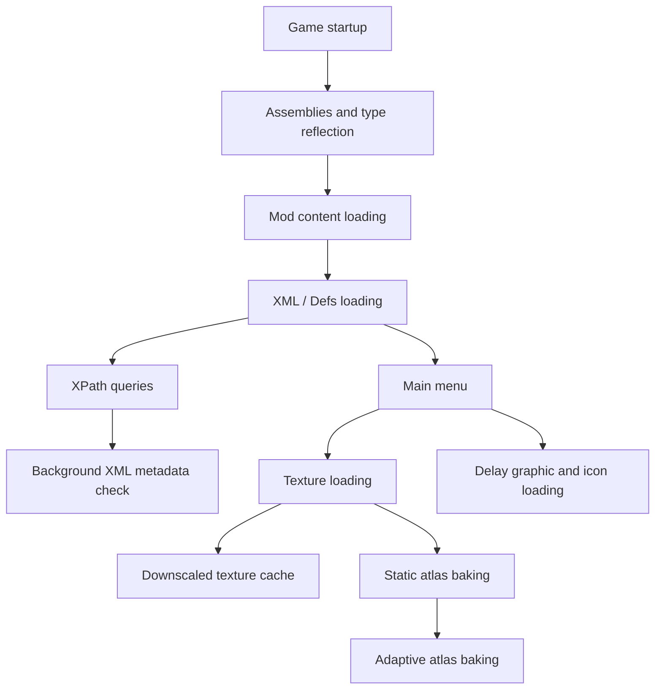

# Faster Game Loading - Continued

[](http://rimworldgame.com/)


Makes RimWorld reach the main menu faster on large mod lists. This mod reduces startup costs from XML loading, reflection, textures, and atlas work without changing gameplay or save data.

## Startup Flow



## Features

Enabled by default:

- **Load mod content early**: Processes some mod content and type reflection during otherwise idle loading gaps, after RimWorld's vanilla mod content scheduling and assembly loading have completed.
- **Multi-threaded preloading**: Loads XML assets in parallel while preserving RimWorld's original load-folder override order.
- **XPath caching**: Caches common missing XML queries during startup. Background validation checks only XML metadata (path, size, modified time), so it no longer reads full XML file contents.

Disabled by default:

- **Delay graphic and icon loading**: Moves some non-essential visual and icon work to batched processing after entering the game.
- **Adaptive atlas baking**: Batches static atlas work based on hardware behavior and avoids known risky race/multi-mask textures.
- **Verbose logging**: Prints debugging messages.

Manual tool:

- **Downscale textures**: Downscales high-resolution textures into a separate cache. Original mod files are never modified. If you already use Image Opt, Graphics Settings+, or RimSort Optimize Texture, you usually do not need this.
- **Clear texture cache**: Removes cached downscaled textures so original textures are used on the next startup.

## Notes

- XPath caching may rebuild after the first launch, mod updates, or XML edits.
- XML edits are detected when file path, size, or modified time changes.
- Brief startup unresponsiveness can be normal, especially with large mod lists.
- **Delay graphic and icon loading** is an advanced option. If you see texture or icon timing issues, disable it first.
- Downscaled texture cache can be cleared from the mod settings.

## Compatibility

Compatibility handling exists for:

- Loading Progress
- Missile Girl - Performance Mod
- DefLoadCache
- Image Opt
- Graphics Settings+
- HugsLib
- XmlExtensions
- AyaTweaks / Ayameduki mods
- Humanoid Alien Races
- Ancot Library / Ancot's Races Framework
- ChezhouLib

Important behavior:

- When Missile Girl is active, XPath caching and background XML change scanning are disabled to avoid conflicting with its cache system.
- When Image Opt, Graphics Settings+, or RimSort Optimize Texture is active, FGL's downscaled texture replacement steps aside.
- Invalid Image Opt `.dds` / `.dds.zstd` cache files are cleaned from texture folders only.
- HAR and Ancot-related race mods skip some early-loading and atlas-baking paths to reduce bodyAddon, hair, ear, and multi-mask texture issues.

## Recommended Settings

Most players should start with the defaults.

If loading is still slow:

1. Keep **Load mod content early**, **Multi-threaded preloading**, and **XPath caching** enabled.
2. For large texture-heavy mod lists, prefer Image Opt / Graphics Settings+ / RimSort Optimize Texture.
3. If you do not use an external texture tool, consider FGL's **Downscale textures** tool.
4. Enable **Delay graphic and icon loading** or **Adaptive atlas baking** only if you are willing to troubleshoot compatibility issues.

## Project Structure

```text
FasterGameLoading/
├── About/                         # Mod metadata
├── Assemblies/                    # Compiled DLL
├── LanguageData/                  # Translation XML files
├── Source/
│   ├── Core/                      # Mod entry point and startup cleanup
│   ├── Settings/                  # Settings and cross-session cache data
│   ├── XMLLoadingCache/           # XML loading and XPath caching
│   ├── EarlyModContentLoading/    # Load mod content early and reflection cache
│   ├── TextureDownscaler/         # Downscale textures and cache loading
│   ├── SmarterAtlasBaking/        # Adaptive atlas baking
│   ├── DelayGraphicAndIconLoading/# Delay graphic and icon loading
│   ├── DelaySoundLoading/         # Deferred sound resolution
│   ├── Compatibility/             # Third-party mod compatibility handling
│   ├── Utilities/                 # Shared helpers
│   └── FasterGameLoading.Tests/   # NUnit tests
└── README.md
```

## Credits

Original mod by Taranchuk. This is a maintained fork with compatibility fixes and performance improvements.
