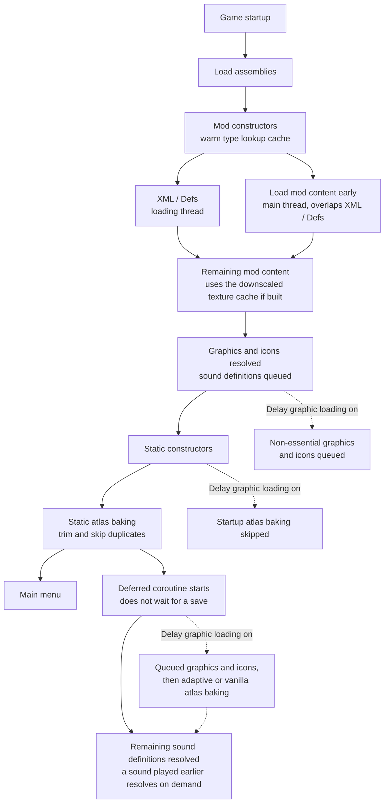

# Faster Game Loading - Continued

[](http://rimworldgame.com/)
[](LICENSE)


Makes RimWorld reach the main menu faster on large mod lists. This mod reduces startup costs from XML loading, reflection, textures, and atlas work without changing gameplay or save data.

Original mod by [Taranchuk](https://github.com/Taranchuk/FasterGameLoading); this is a maintained fork with compatibility fixes and performance improvements.

## Installation

> [!IMPORTANT]
> Requires RimWorld 1.6 and [Harmony](https://github.com/pardeike/HarmonyRimWorld/releases/latest). Load this mod after Harmony.

- **Steam Workshop**: subscribe on the [Workshop page](https://steamcommunity.com/sharedfiles/filedetails/?id=3652938473).
- **Manual**: download or clone this repository into your `RimWorld/Mods/` folder, then enable **Faster Game Loading - Continued** in the in-game mod list.

All options live in `Options → Mod options → Faster Game Loading - Continued`. Most players can keep the defaults; see [Recommended Settings](#recommended-settings).

## Startup Flow


```mermaid
graph TD
    A[Game startup] --> B[Load assemblies]
    B --> C[Mod constructors<br/>warm type lookup cache]
    C --> D[XML / Defs<br/>loading thread]
    C --> E[Load mod content early<br/>main thread, overlaps XML / Defs]
    D --> F[Remaining mod content<br/>uses the downscaled texture cache if built]
    E --> F
    F --> G[Graphics and icons resolved<br/>sound definitions queued]
    G --> H[Static constructors]
    H --> I[Static atlas baking<br/>trim and skip duplicates]
    I --> J[Main menu]
    I --> K[Deferred coroutine starts<br/>does not wait for a save]
    K --> L[Remaining sound definitions resolved<br/>a sound played earlier resolves on demand]
    G -. Delay graphic loading on .-> M[Non-essential graphics<br/>and icons queued]
    H -. Delay graphic loading on .-> N[Startup atlas baking skipped]
    K -. Delay graphic loading on .-> O[Queued graphics and icons,<br/>then adaptive or vanilla atlas baking]
    O -.-> L
```

With the default settings, mod content, graphics, icons and static atlases are ready before the main menu; only sound definitions finish after it. The deferred coroutine is started by a startup callback, so it runs while the main menu is shown instead of waiting for a save to load. The downscaled texture cache is built manually with the **Downscale textures** tool and used by later startups.

## Features

Enabled by default:

- **Load mod content early**: Processes pending mod content during idle loading gaps before RimWorld's normal `ReloadContentInt` pass reaches those mods. It starts only after every mod constructor has run (at `LoadModXML`), so FGL's and other mods' Harmony patches already apply to early-loaded content. It stops once `PlayDataLoader.Loaded` is true and does not restart on language changes. The frame budget is checked between mods, so one large mod can still take a long frame. Texture byte preloading is skipped when Graphics Settings+ or Image Opt is active; bytes already read on the main thread are not prefetched again.
- **Multi-threaded preloading**: Loads XML assets in parallel while preserving RimWorld's original load-folder override order. With Hyperdrive, `Defs/` XML loading is left to Hyperdrive. A background thread also reads original texture files into memory in the order mods load them, holding at most 256 MB at a time, so the main thread does not wait on disk reads while loading textures. Files the main thread skips are released, and the rest is freed when startup finishes. This is skipped when Graphics Settings+ or Image Opt loads textures.
- **Type lookup cache**: Warms full type names before XML parsing and remembers resolved names across sessions. It follows RimWorld's assembly search order; full names that differ only in letter case are left to RimWorld's case-insensitive lookup so the same type is chosen. It refreshes when the mod list or any game/mod assembly changes, and falls back to RimWorld's lookup for stale entries. Harmony `AccessTools.TypeByName` keeps a separate per-session cache. Each assembly's types are listed once and shared with the `AccessTools.AllTypes` cache, which is rebuilt when an assembly is added or a dynamic assembly defines new types. Changes take effect after restarting the game.
- **Trim static atlases**: RimWorld packs each static atlas into a power-of-two height and doubles that height when the first attempt does not fit, so large atlases are often half empty rows. Each atlas keeps one empty row per mipmap level, with its height rounded up so every mip level is a multiple of 8 pixels for GPU compression. Every texture keeps its pixel position. Applies to RimWorld's baking and to **Adaptive atlas baking**. Changes take effect after restarting the game.
- **Skip duplicate atlas textures**: RimWorld queues a minifiable building's texture for the Building, Item and Misc atlases. Item and Misc copies are skipped when the texture is also queued for Building and its mask state is consistent across all queued groups. Copies with conflicting mask states are preserved so cross-group lookup cannot select the wrong mask. RimWorld's "found in another atlas group" warning is silenced for removed copies only. Changes take effect after restarting the game.

Always on (no setting):

- **Deferred sound resolution**: RimWorld's sound definition (`SubSoundDef`) resolution is queued and finished by the deferred coroutine after the main menu appears, even when **Delay graphic and icon loading** is off. A sound requested before its definition is resolved (for example a main-menu hover or click) is resolved on the spot and then played, so main-menu UI sounds work from the start; UI sounds take well under a millisecond each, while a sound with long clips (such as Anomaly ambience) can take up to about 200 ms; vanilla spends that same time before the main menu. Requests made off the main thread, or for sounds whose definitions are not queued yet (for example during a language-switch reload), are skipped, as before. With **Delay graphic and icon loading** on, the remaining sounds resolve after the deferred graphics, icons and atlas baking. Entering a world resolves any remaining sounds immediately.

Disabled by default:

- **Delay graphic and icon loading**: Moves some non-essential visual and icon work to batched processing after the startup callbacks; it begins while the main menu is shown, without waiting for a save to load. Essential categories such as furniture are chosen after Def references resolve. RimWorld's `ResolveIcon` handles icons before deferred atlas baking. Changes take effect after restarting the game.
- **Adaptive atlas baking**: Only takes effect together with **Delay graphic and icon loading**. The deferred static atlases are baked one atlas per frame. Each batch targets an amount of pixels sized from the measured GPU speed, at least 1024×1024 pixels' worth, so rendering still benefits from batching; the last batch of a group may be smaller, and a batch with a single texture uses that texture directly, so individual atlases can be smaller than 1024×1024. The 8 ms per-atlas target is not a hard cap: one large atlas can still take longer in a single frame. Textures queued by other mods while baking is in progress are baked too. Without delayed loading, RimWorld's original baking is used. Known risky race/multi-mask textures are kept out of static atlases. Changes take effect after restarting the game.
- **Faster atlas compression**: On the CPU path, compresses the baked static atlases with `Texture2D.Compress(highQuality: false)` instead of `true`. The high-quality mode adds dithering and takes longer. GPU compression is unchanged. Changes take effect after restarting the game.
- **Verbose logging**: Prints debugging messages.

Manual tool:

- **Downscale textures**: Shows a loading screen while it downscales high-resolution textures into a separate cache (in successive halving steps to avoid aliasing). Original mod files are never modified, and cached textures use RimWorld's filtering and compression pipeline. Textures under `/UI/` keep mipmaps disabled. Original files are read and the cache PNGs are encoded and written on background threads; only decoding and GPU resizing run on the main thread. When the mod list changes, cache entries for still-active mods are retained. Rebuilding replaces the previous cache only after every new file is in place; if any cache file fails to write, or nothing could be written, the previous cache is kept. If you already use Graphics Settings+ or RimSort Optimize Texture, you usually do not need this. While Graphics Settings+ or Image Opt is loading textures, the tool is unavailable and the button is hidden.
- **Clear texture cache**: Shows a loading screen while it removes cached downscaled textures, so original textures are used on the next startup.

> [!NOTE]
> Brief startup unresponsiveness can be normal, especially with large mod lists. Sound definitions that are not resolved yet are resolved when a sound first plays, so the main menu is not silent.
> **Delay graphic and icon loading** is an advanced option. If you see texture or icon timing issues, disable it first.
> Downscaled texture cache can be cleared from the mod settings.
> Translations are provided for English, Simplified Chinese, Traditional Chinese and Russian. Other languages, and keys missing from a translation, fall back to English through RimWorld's own translation lookup, so with Dev Mode on they show RimWorld's pseudo-translated (accented) English, its marker for untranslated text.

## Compatibility

Compatibility handling exists for:

- [Loading Progress](https://github.com/ilyvion/LoadingProgress)
- [Graphics Settings+](https://github.com/RealTelefonmast/GraphicsSetter)
- [HugsLib](https://github.com/UnlimitedHugs/RimworldHugsLib)
- [AyaTweaks](https://gitlab.com/WRelicK/AyaTweaks2.0) / Ayameduki mods
- [Humanoid Alien Races](https://github.com/erdelf/AlienRaces)
- [Ancot Library](https://steamcommunity.com/sharedfiles/filedetails/?id=2988801276)
- [ChezhouLib](https://steamcommunity.com/sharedfiles/filedetails/?id=3595247479)
- [Hyperdrive](https://github.com/vopaga/rimworld-hyperdrive)

Important behavior:

- With [Hyperdrive](https://github.com/vopaga/rimworld-hyperdrive), Faster Game Loading leaves parallel `Defs/` XML loading to Hyperdrive, which loads mods in parallel, and still parallelizes `Patches/` XML within each mod. Hyperdrive turns off its parallel mod loading when another mod has already patched `LoadModXML`. RimWorld does not construct mod classes in load order, so Faster Game Loading waits until Hyperdrive is constructed before it patches `LoadModXML`. This works in any load order. If Hyperdrive still turns off its parallel loading, Faster Game Loading keeps parsing `Defs/` in parallel itself.

- [Missile Girl - Performance Mod](https://github.com/ViralReaction/MissileGirl) and [DefLoadCache](https://github.com/FluxxField/rimworld-defload-cache) have no dedicated compatibility code in this mod. They are expected to work alongside Faster Game Loading, but use either Missile Girl or DefLoadCache, not both.
- [Image Opt](https://steamcommunity.com/sharedfiles/filedetails/?id=3543873568) compatibility is no longer maintained. When Faster Game Loading and Image Opt are enabled together, mods that depend on [Ancot Library](https://steamcommunity.com/sharedfiles/filedetails/?id=2988801276) may encounter graphical loading errors, missing textures, or black textures under some loading conditions. Using both mods together is not recommended; use [Image Opt fork](https://steamcommunity.com/sharedfiles/filedetails/?id=3781013698) instead.
- Existing Image Opt safeguards, such as downscaled-texture bypass and invalid `.dds` / `.dds.zstd` cache cleanup, do not guarantee compatibility.
- [Image Opt fork](https://steamcommunity.com/sharedfiles/filedetails/?id=3781013698) is an alternative to Image Opt, patched by its author for compatibility with Faster Game Loading. Load it after Faster Game Loading.
- [Humanoid Alien Races](https://github.com/erdelf/AlienRaces) counts each race's texture variants as soon as its own textures are loaded. Faster Game Loading holds that count until all mod content has loaded, so variants from race mods that load later are not missed. With this in place, HAR and the race mods that depend on it are loaded early and have their XML parsed in parallel like other mods. If the hook cannot be found or patched, they are excluded from both again.
- HAR (including its dev build) and Ancot-related race mods are not downscaled and stay out of **Adaptive atlas baking**, to reduce bodyAddon, hair, ear, and multi-mask texture issues. The same applies to [Pumpkin Library](https://steamcommunity.com/sharedfiles/filedetails/?id=3790461769) DDS texture packs that replace those mods' textures, as listed in Pumpkin Library's `TextureOverrideSettings.xml`. AyaTweaks and Ayameduki mods skip early loading and parallel XML parsing.
- With [ChezhouLib](https://steamcommunity.com/sharedfiles/filedetails/?id=3595247479), Faster Game Loading's guard against loading the same asset bundles twice runs before ChezhouLib's asset bundle loader.

## Recommended Settings

Most players should start with the defaults.

If loading is still slow:

1. Keep **Load mod content early**, **Multi-threaded preloading**, and **Type lookup cache** enabled.
2. For large texture-heavy mod lists, prefer Graphics Settings+ or RimSort Optimize Texture. Image Opt compatibility is no longer maintained; use [Image Opt fork](https://steamcommunity.com/sharedfiles/filedetails/?id=3781013698) instead.
3. If you do not use an external texture tool, consider FGL's **Downscale textures** tool.
4. Enable **Delay graphic and icon loading** or **Adaptive atlas baking** only if you are willing to troubleshoot compatibility issues.

## Project Structure

```text
FasterGameLoading/
├── About/                         # Mod metadata, preview, and Workshop id
├── Assemblies/                    # Compiled DLL
├── LanguageData/                  # Translation XML files (EN, zh-TW, zh-CN, RU)
├── SteamDescriptions/             # Steam Workshop description sources
├── Source/
│   ├── Core/                      # Mod entry point and startup cleanup
│   ├── Settings/                  # Settings and cross-session cache data
│   ├── XMLLoadingCache/           # Parallel XML loading
│   ├── EarlyModContentLoading/    # Load mod content early and reflection cache
│   ├── TextureDownscaler/         # Downscale textures and cache loading
│   ├── AdaptiveAtlasBaking/       # Adaptive atlas baking
│   ├── StaticAtlasOptimizations/  # Trim, skip duplicates and compress static atlases
│   ├── DelayGraphicAndIconLoading/# Delay graphic and icon loading
│   ├── DelaySoundLoading/         # Deferred sound resolution
│   ├── Compatibility/             # Third-party mod compatibility handling
│   ├── Language/                  # In-game translation injection
│   ├── Utilities/                 # Shared helpers
│   └── FasterGameLoading.Tests/   # NUnit tests
├── LICENSE
└── README.md
```

## Building from Source

The main project targets .NET Framework 4.7.2 and references RimWorld via the [Krafs.Rimworld.Ref](https://www.nuget.org/packages/Krafs.Rimworld.Ref) NuGet package, so no local RimWorld installation is needed to compile. The compiled DLL is written to `Assemblies/`.

```bash
dotnet build Source/FasterGameLoading.csproj -c Release
```

Tests use NUnit on .NET 9:

```bash
dotnet test Source/FasterGameLoading.Tests/FasterGameLoading.Tests.csproj --settings test.runsettings
```

## Credits and License

Original mod by [Taranchuk](https://github.com/Taranchuk/FasterGameLoading). This fork is maintained by [mushroomTW](https://github.com/mushroomTW/FasterGameLoading---Continued) with compatibility fixes and performance improvements.
